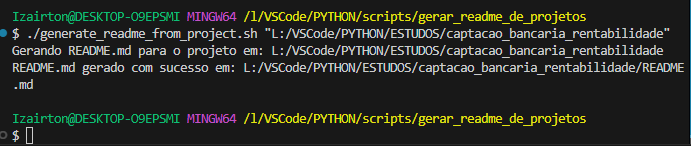

# 🗂️ Projeto: Gerador de README.md

## 📝 Descrição

Este projeto foi analisado automaticamente pelo script e contém as seguintes configurações e informações.
Ele tem como objetivo principal automatizar a geração de arquivos README.md para projetos, garantindo padronização
e economia de tempo.

## 🎯 Objetivo do Projeto

O objetivo principal deste projeto é facilitar a documentação de projetos ao gerar automaticamente arquivos
README.md completos e organizados, permitindo que desenvolvedores foquem na construção do código sem comprometer
a qualidade da apresentação do projeto.

## 🚀 Funcionalidades

- **Geração Automática:** O script analisa o projeto, identifica bibliotecas utilizadas e estrutura um README.md completo.
- **Personalização:** Permite ajustes específicos conforme a necessidade do projeto.
- **Compatibilidade:** Funciona com diversos tipos de projetos e linguagens.

## 📂 Estrutura do Projeto

Abaixo está uma visualização da estrutura do projeto (pastas primeiro, seguidas de arquivos):

├── data
├── docs
├── images
├── src
├── tests
├── convert_thumb.py
├── desktop.ini
├── gerar_relatorio.py
├── main.py
├── README.md
├── relatorio_rentabilidade.pdf
├── requirements.txt
├── setup_project.sh
├── USAGE.md

## 🏆 Benefícios do Gerador de README.md

- **Precisão:** Garante a inclusão das informações essenciais, sem erros manuais.
- **Eficiência:** Reduz o tempo gasto na criação de documentações.
- **Clareza:** Ajuda a estruturar a apresentação do projeto de forma compreensível.

## 🖥️ Como usar o script

1. Salve o script como "generate_readme_from_project.sh"

2. Dê permissão de execução ao script:

      chmod +x generate_readme_from_project.sh

3. Execute o script passando o nome do projeto como argumento:

      ./generate_readme_from_project.sh nome_do_projeto

   Exemplo:
   .generate_readme_from_project "L:/VSCode/PYTHON/ESTUDOS/captacao_bancaria_rentabilidade

## 🖥️ GitHub

1. Clone o repositório:

   Exemplo:
   git clone <https://github.com/iovascon/captacao_bancaria_rentabilidade.git>

## 💻 Ambiente Virtual

1. Configure o ambiente virtual (se necessário):

   python3 -m venv venv
   source venv/bin/activate

2. Instale as dependências:

   pip install -r requirements.txt

3. Execute o programa principal:

   python src/main.py

   Ambiente virtual configurado: **Sim (usando requirements.txt)**

## 📦 Bibliotecas Utilizadas

As bibliotecas identificadas no projeto são:

pandas==2.2.3
tabulate==0.9.0

## 🚀 Tecnologias Utilizadas

As principais tecnologias utilizadas no projeto incluem:

- [Python]<https://www.python.org/>
- Markdown
- GitHub
- Outras tecnologias podem ser descritas aqui.

## 🛠️ Tarefas

- [ ] Implementar validações adicionais.
- [x] Criar interface para usuários.
- [ ] Melhorar documentação.

## 🗂️ Histórico de Lançamento

- **0.2.0**
  - MUDANÇA: Remover função antiga
  - ADICIONAR: Implementar init()
- **0.1.1**
  - CORREÇÃO: Resolver travamento ao executar foo()
- **0.1.0**
  - MUDANÇA: Refatorar foo() para bar()
- **0.0.1**
  - Inicializar o projeto

## 🤝 Contribuições

Feedbacks e sugestões são sempre bem-vindos! Sinta-se à vontade para abrir [**issues**]<https://github.com/IOVASCON/projeto/issues> ou enviar [**pull requests**]<https://github.com/IOVASCON/projeto/pulls>.

Espero que este README seja útil para explicar o projeto e atrair atenção de colaboradores e usuários. Se precisar de ajustes ou personalizações, é só avisar! 🚀

## 👥 Autor

- [@iovascon]<https://github.com/IOVASCON>

## 📜 Licença

Este projeto está sob a licença [MIT]<https://opensource.org/licenses/MIT>.
